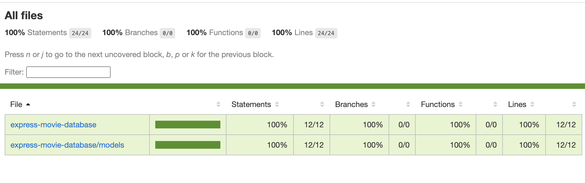
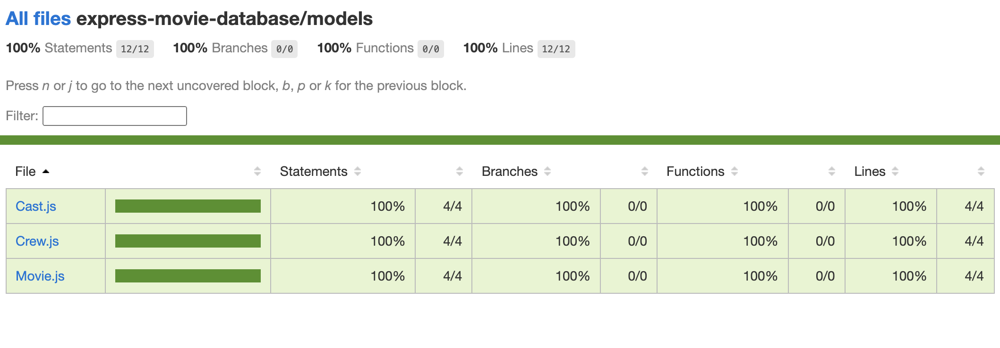

# Express Movie Database
**Description** 
* Express Movie Database is an API where you can create, update select and delete data from the database.

**Technologies Used** 
* Javascript, Node, Sequelize, Express, Jest & Sqlite3

**Project Planning**

**Testing**

